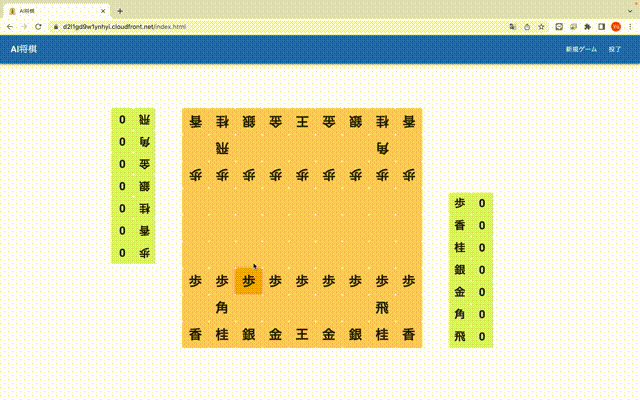

# SHOGI

将棋AIの学習・Lambdaへのデプロイ・ReactによるWebアプリ上でのプレイを行う

* AIの学習
  * 強化学習
    * PyTorch
    * DQN
    * CNN
  * 教師あり学習
    * PyTorch
* サーバーサイド
  * APIサーバー
    * FastAPI
  * LambdaのRestAPI
    * Lambda (Docker)
* クライアントサイド
  * React
  * Recoil
  * MUI (v5)



## 動作環境

python3.9

## 将棋AIの学習

### 強化学習

学習

```shell
$ PYTHONPATH=. python3 training/reinforcement_learning/train.py
```

推論

```shell
$ PYTHONPATH=. python3 training/reinforcement_learning/test.py
```

### 教師あり学習

事前に `kifu/hcp` にhcp形式のファイルを保存してください

```shell
$ PYTHONPATH=. python3 training/supervised_learning/train.py
```

## AI指手のAPI構築

### AI指手のFastAPIサーバーのローカル実行

サーバーの立ち上げ

```shell
$ PYTHONPATH=. uvicorn apps.app_server:app --reload
```

リクエストを送る

```shell
$ curl -XPOST -d '{"moves": ["7776FU", "3334FU"]}' -H "Content-Type: application/json" localhost:8000/move
```

※ CPUでCNNの推論を行うため、Memory ~ 3GB, Duration ~ 1sほど要します.

### AI指手のLambdaサーバーのローカル実行

dockerイメージ作成

```shell
$ docker build -t shogi-lambda:latest -f ./apps/Dockerfile .
```

dockerコンテナの実行開始

```shell
$ docker run -p 9000:8080 shogi-lambda:latest
```

リクエストを送る

```shell
$ curl -XPOST "http://localhost:9000/2015-03-31/functions/function/invocations" -d '{"moves": ["7776FU", "3334FU"]}'
```
